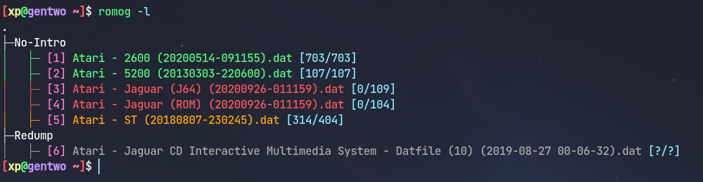

# romorganizer

## Introduction
romorganizer is a ROM manager written in C++, specifically for Linux.

romorganizer is designed to be run from the terminal and is command-line only, making it scriptable and ideal for headless servers.

**WARNING: This project is still in the experimental stage and as such, expect bugs to occur. It is your responsibility to make backups of your sets before using this tool. I work on this in my free time, so do not expect a predictable release/commit schedule.**



## Disclaimer
This tool does not condone usage of unauthorized downloaded game ROMs, and does not provide means to acquire any ROMs. Only use this tool with ROMs you personally copied from game medium(s) that you own. Do not distribute any ROMs and once you do not own the original game medium(s) anymore, remove the ROMs/copies that you have made.

## Features
- Easy batch scanning of DAT files
- Shows which of your DATs are outdated
- Automatic downloading/sorting of new DATs from download links in a text file
- Color output in terminal!

## To-Do List
- Scanning without fixing, instead showing what needs to be renamed/removed
- Header-skipping support
- 7zip support
- Level 2/3 scanning
- TOSEC DATs support

## Build from source
1. Install these dependencies through your package manager: `openssl`, `pugixml`, `xalan-c`, `xerces-c`, `libarchive`, `yaml-cpp`, `curl`. Install `git`, `make`, `gcc` if you don't have them.
2. Clone the repository: `git clone https://github.com/xprism1/romog.git`
3. Go to the include directory: `cd romog/include` and modify `paths.h`, replacing the paths in quotes with the paths you wish to use.
3. Change to the source directory: `cd ../romog/src`
4. `mkdir obj/` if it is not present, then to build romog: `make -jX` and `sudo make install`, where X is the number of jobs you wish to use for compilation. (`sudo make uninstall` to uninstall.)
5. Copy `sort.xsl` to what you specified in `sort_xsl_path` in `paths.h` in Step 3.

## Usage
See the [wiki](https://github.com/xprism1/romog/wiki) for a detailed guide on how to use romorganizer.

## Libraries used
The project uses the following libraries:
```
curl
libarchive
openssl
pugixml
xalan-c
xerces-c
yaml-cpp
docopt [included in repo]
libfort [included in repo]
termcolor [included in repo]
zip [included in repo]
```

## Project Layout
```
├─ include/         Header files
├─ libs/            Libraries provided that are required for building
├─ others/          Sample files for your use
└─ src/             Application source code
```

## Licensing
All external code is attributed to the site and/or person(s) that originally wrote the code.

All code written in `src/` is licensed under AGPL v3. See `LICENSE` for more details.

## Contributions
Any feature suggestions or code contributions are accepted. Contributors will be attributed in `README.md`.